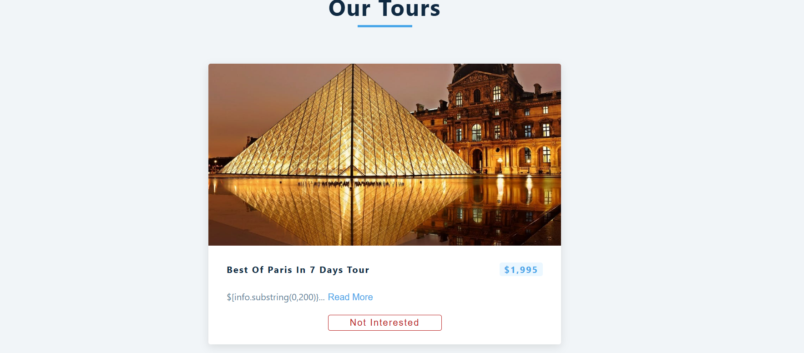

# tours

this project shows tour picture

it use tour project url

with the use of fetch function it renders data from url

and set the data to tour using useState hooks

when the page start it render the fetch function using useEffect hooks

and more ....

it use also subString method to display part of string 

try catch method also implemented

# the final page looks like

# Bisrat
# october 29 